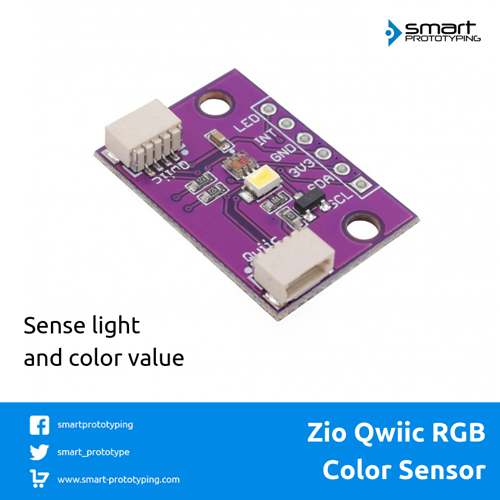

# Zio Qwiic RGB Color Sensor (TCS34725)

> This product can be available for purchase [here](https://www.smart-prototyping.com/Zio-Qwiic-RGB-Color-Sensor-TCS34725).

#### Description

The Qwiic Color Sensor board features one of the best color sensor on the market to monitor a specific color value and light sensing.

The board features a TCS34725 with I2C interface and minimizes the IR and UV spectral to make the color measurements as accurate as possible. 
 
The high sensitivity, IR blocking filter and wide dynamic range (3.8M:1) with adjustable integration time and gain make the sensor a great solution for use under different light conditions and attenuating materials. 
 
Finally, we specified a nice neutral 4150°K temperature LED with a MOSFET driver onboard to illuminate what you're trying to sense. The LED can be easily turned on or off by any logic level output.
 
The Zio Qwiic RGB Color Sensor uses the Qwiic connector for deasy chain with any Qwiic compatible boards. Just in case you would like to use this board without the Qwiic connector, we have incorporated header pins. As well as if you’d like to access the LED and INT pins.
 

#### Specification

* Operation Voltage: 3.3V
* Interface: I2C (address 0x29)
* Dimensions:18.1x25.5mm
* Weight:1.2g

#### Links

* [PCB Source File and Schematic](https://github.com/ZIOCC/Zio-Qwiic-RGB-Color-Sensor-TCS34725)
* [TCS34725 Datasheet](https://ams.com/documents/20143/36005/TCS3472_DS000390_2-00.pdf/)
* [Adafruit TCS34725 master Library](https://github.com/adafruit/Adafruit_TCS34725)

> ###### About Zio
> Zio is a new line of open sourced, compact, and grid layout boards, fully integrated for Arduino and Qwiic ecosystem. Designed ideally for wearables, robotics, small-space limitations or other on the go projects. Check out other awesome Zio products [here](https://www.smart-prototyping.com/Zio).
